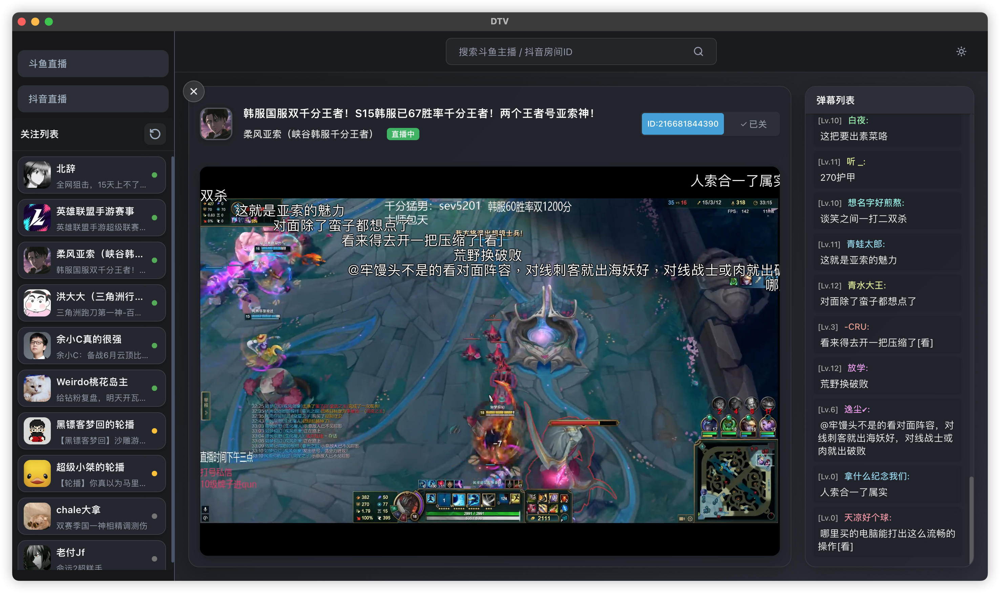

<div align="center">
  
  <h1>DTV</h1>
  <p>基于 Electron 的跨平台非官方斗鱼直播精简版桌面客户端</p>
</div>

## 说明

1. 本项目最初基于 Tauri 开发，由于编译问题改为使用 Electron 重构

2. 搜索接口有访问频率限制，过于频繁的搜索请求会触发验证码校验，建议合理使用搜索功能

3. 本项目仅供学习编程目的使用，未进行任何逆向工程

## 软件截图

<div align="center">
  <div style="display: flex; justify-content: center; gap: 20px;">
    <div>
      
      <p>日间模式</p>
    </div>
    <div>
       
      <p>夜间模式</p>
    </div>
  </div>
</div>

## 安装方式

可以在 [release](https://github.com/c-zeong/dtv/releases) 目录下载对应系统的安装包

## 编译

```
git clone https://github.com/c-zeong/dtv.git
cd dtv
npm install

#开发调试
npm run start-dev

#打包构建
npm run dist #macOS 版本 包括arm/Intel
npm run build:win #win 版本
npm run build:linux #linux 版本
```


##  参考

- 直播流获取参考了 [@wbt5/real-url](https://github.com/wbt5/real-url) 项目并改写为 TypeScript 版本 